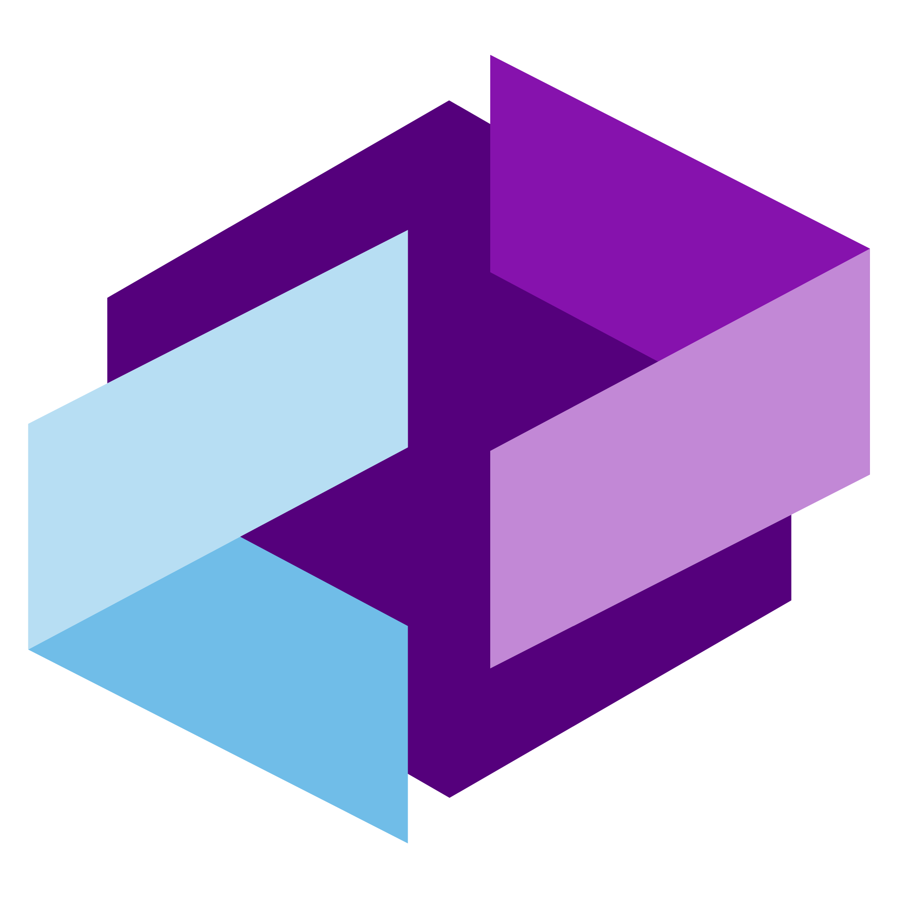
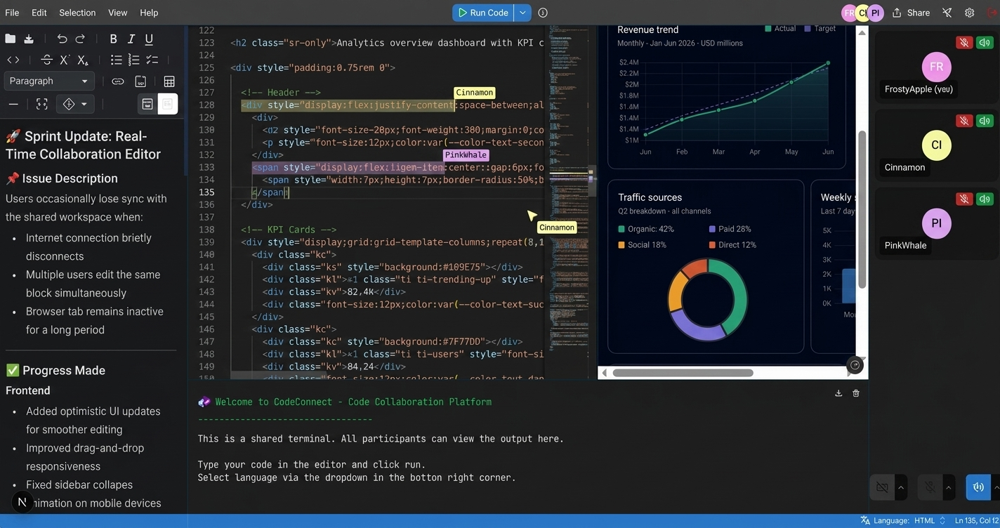

<h1 align="center" style>
  <br>
  <a href="https://codeconnect-dev.vercel.app" target="_blank"></a>
  <br>
  Code Connect
  <br>
</h1>

<h4 align="center">
  Code Connect is a browser-based collaborative development platform that enables real-time coding, live previews, shared terminals, video communication, and collaborative note-taking.
</h4>

<p align="center">
  <a href="" target="_blank">
    
  </a>
  <a href="" target="_blank">
    
  </a>
  <a href="" target="_blank">
    
  </a>
  <a href="" target="_blank">
    
  </a>
  <a href="https://choosealicense.com/licenses/mit" target="_blank">
    
  </a>
  <a href="" target="_blank">
    
  </a>
</p>

<p align="center">
  <a href="#key-features">Key Features</a> •
  <a href="#how-to-use">How To Use</a> •
  <a href="#how-to-contribute">How To Contribute</a> •
  <a href="#technologies">Technologies</a> •
  <a href="#license">License</a>
</p>

<p align="center">
  
</p>

🌐 **Live Demo**🔗 [codeconnect-dev.vercel.app](https://codeconnect-dev.vercel.app)

## Key Features

- **Real-time Collaboration** - Code together in real-time with cursor sharing, highlighting, and follow mode

- **Shared Terminal** –Execute code and see results together with over 80 supported languages (local Piston setup required)

- **Live Preview** – Preview UI changes instantly with loaded libraries like Tailwind CSS, and more

- **GitHub Integrated** – Save your work and open files from your repositories

- **Shared Notepad** – Take notes together in real-time with rich text and markdown support

- **Video & Voice** – Communicate with your team using video and voice chat

## Project Structure

```
CodeConnect
├── client/             # Frontend Next.js application
│   ├── public/         # Static assets
│   └── src/            # Source code
│       ├── app/        # Next.js app router pages and API routes
│       ├── components/ # React components
│       ├── hooks/      # Custom React hooks
│       └── lib/        # Utility functions and services
└── server/             # Backend Socket.IO server
    └── src/            # Source code
        ├── service/    # Backend services
        └── utils/      # Utility functions

```

## How To Use

To clone and run this application, you'll need [Git](https://git-scm.com) and [Node.js](https://nodejs.org/en/download) (which comes with [npm](http://npmjs.com)) installed on your computer. From your command line:

##### Clone this repository

```bash
$ git clone <your-repo-url>
$ cd code-connect
```

##### Frontend setup (Terminal 1)

```bash
$ cd client
$ npm install
$ cp .env.example .env # Configure variables
$ npm run dev
```

##### Backend setup (Terminal 2)

```bash
$ cd server
$ npm install
$ cp .env.example .env  # Configure variables
$ npm run dev
```

##### Optional: Enable Local Code Execution

Code execution is disabled in the hosted demo. To enable the shared terminal and code runner locally, you'll need to run a self-hosted Piston instance.

```bash
# Clone Piston
$ git clone https://github.com/engineer-man/piston
$ cd piston

# Start the API
$ docker compose up -d api

# Install CLI dependencies
$ cd cli
$ npm install

# Install runtimes
$ node index.js ppman install python
$ node index.js ppman install node
$ node index.js ppman install typescript
$ node index.js ppman install java
```

Configure the client environment:

```env
PISTON_API_URL=http://localhost:2000/api/v2/execute
```

Once configured, Code Connect will be able to execute code through your local Piston instance.

##### The Application will be available at:

- Frontend: http://localhost:3000
- Backend: http://localhost:3001

## How to Contribute

1. Clone the repo and create a new branch: `git checkout -b name_for_new_branch`.
2. Make changes and test
3. Submit Pull Request with comprehensive description of changes

## Technologies

This software uses the following technologies:

- **Frontend:** Next.js 15, React 19, TypeScript, TailwindCSS, shadcn.ui, Monaco Editor (code editor), Socket.IO Client, MDXEditor (notepad), simple-peer (WebRTC), Radix Form

- **Backend:** Node.js, Express, Socket.IO (binded to µWebSockets.js server)

- **Build & DevOps:** GitHub Actions (CI/CD), Vercel (frontend deployment), Render (backend deployment)

- **External Services:** Piston (code execution), GitHub REST API (repository management)

## License

MIT
