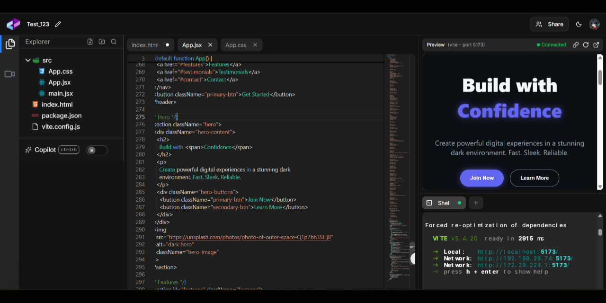

<h1 align="center" style>
  <br>
  <a href="https://code-connect-site.vercel.app" target="_blank"></a>
  <br>
  Code Connect
  <br>
</h1>

<h4 align="center">
  CodeConnect is an online code collaboration platform that enables real-time coding, cursor sharing, live UI preview, and video communication with integrated Git support—no sign-up required.
</h4>

<p align="center">
  <a href="" target="_blank">
    
  </a>
  <a href="" target="_blank">
    
  </a>
  <a href="" target="_blank">
    
  </a>
  <a href="" target="_blank">
    
  </a>
  <a href="https://choosealicense.com/licenses/mit" target="_blank">
    
  </a>
  <a href="" target="_blank">
    
  </a>
  <a href="" target="_blank">
    
  </a>
</p>

<p align="center">
  <a href="#key-features">Key Features</a> •
  <a href="#how-to-use">How To Use</a> •
  <a href="#how-to-contribute">How To Contribute</a> •
  <a href="#technologies">Technologies</a> •
  <a href="#license">License</a>
</p>

<p align="center">
  
</p>

🌐 **Live Demo**🔗 [code-connect-site.vercel.app](https://code-connect-site.vercel.app)

## Key Features

- **Real-time Collaboration** - Code together in real-time with cursor sharing, highlighting, and follow mode

- **Shared Terminal** –Execute code and see results together with over 80 supported languages

- **Live Preview** – Preview UI changes instantly with loaded libraries like Tailwind CSS, and more

- **GitHub Integrated** – Save your work and open files from your repositories

- **Shared Notepad** – Take notes together in real-time with rich text and markdown support

- **Video & Voice** – Communicate with your team using video and voice chat

## Project Structure

```
CodeConnect
├── client/             # Frontend Next.js application
│   ├── public/         # Static assets
│   └── src/            # Source code
│       ├── app/        # Next.js app router pages and API routes
│       ├── components/ # React components
│       ├── hooks/      # Custom React hooks
│       └── lib/        # Utility functions and services
└── server/             # Backend Socket.IO server
    └── src/            # Source code
        ├── service/    # Backend services
        └── utils/      # Utility functions

```

## How To Use

To clone and run this application, you'll need [Git](https://git-scm.com) and [Node.js](https://nodejs.org/en/download) (which comes with [npm](http://npmjs.com)) installed on your computer. From your command line:

##### Clone this repository

```bash
$ git clone https://github.com/kunaldasx/code-connect
$ cd code-connect
```

##### Frontend setup (Terminal 1)

```bash
$ cd client
$ npm install
$ cp .env.example .env # Configure variables
$ npm run dev
```

##### Backend setup (Terminal 2)

```bash
$ cd server
$ npm install
$ cp .env.example .env  # Configure variables
$ npm run dev
```

##### The Application will be available at:

- Frontend: http://localhost:3000
- Backend: http://localhost:3001

## How to Contribute

1. Clone repo and create a new branch: `$ https://github.com/kunaldasx/code-connect -b name_for_new_branch`.
2. Make changes and test
3. Submit Pull Request with comprehensive description of changes

## Emailware

Code Connect is an [emailware](https://en.wiktionary.org/wiki/emailware). Meaning, if you liked using this app or it has helped you in any way, I'd like you send me an email at <kunaldasx@gmail.com> about anything you'd want to say about this software. I'd really appreciate it!

## Technologies

This software uses the following technologies:

- **Frontend:** Next.js 15, React 19, TypeScript, TailwindCSS, shadcn.ui, Monaco Editor (code editor), Socket.IO Client, MDXEditor (notepad), simple-peer (WebRTC), Radix Form

- **Backend:** Node.js, Express, Socket.IO (binded to µWebSockets.js server)

- **Build & DevOps:** Cloudflare D1 (SQLite) with Drizzle ORM

- **External Services:** Piston (code execution), GitHub REST API (repository management)

## Support

If you like this project and think it has helped in any way, consider buying me a coffee!

<a href="" target="_blank"></a>

## License

MIT

---

> 🌐 [Visit my website →](https://kunaldasx.vercel.app/)<br>
> 🖥️ [GitHub](https://github.com/kunaldasx) &nbsp;&middot;&nbsp;
> 💼 [LinkedIn](https://www.linkedin.com/in/kunaldasx/) &nbsp;&middot;&nbsp;
> 🐦 [Twitter / X](https://x.com/Kunaldasx) &nbsp;&middot;&nbsp;
